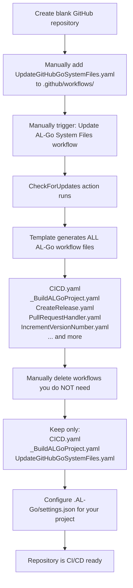
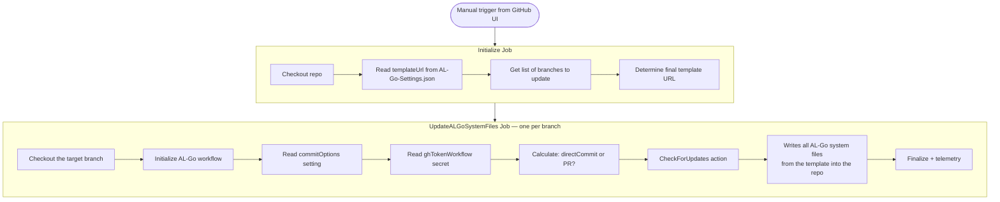
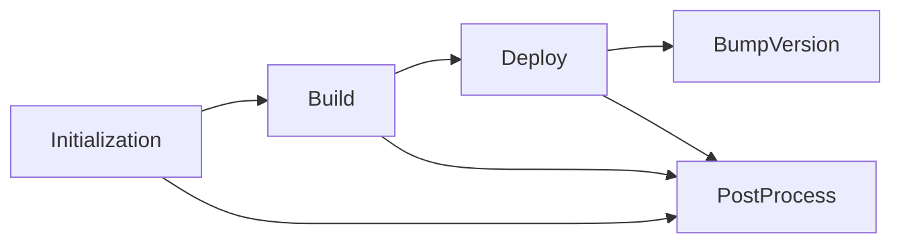
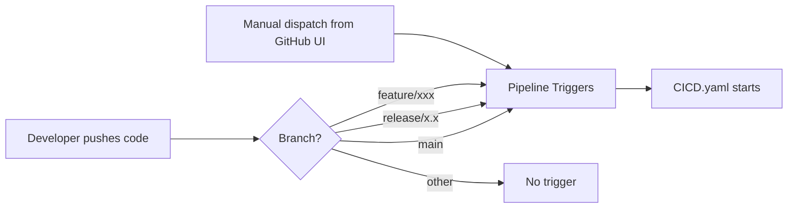
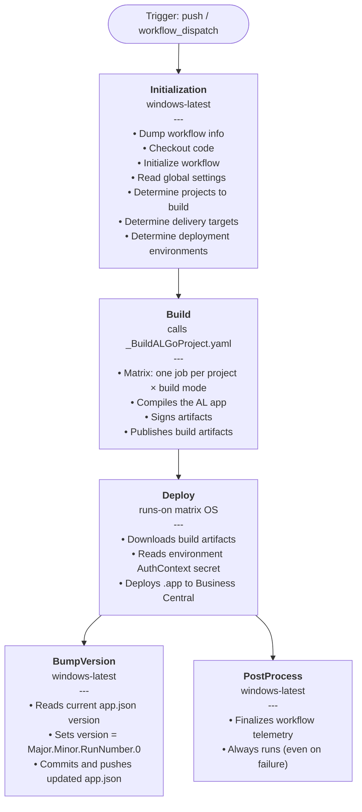
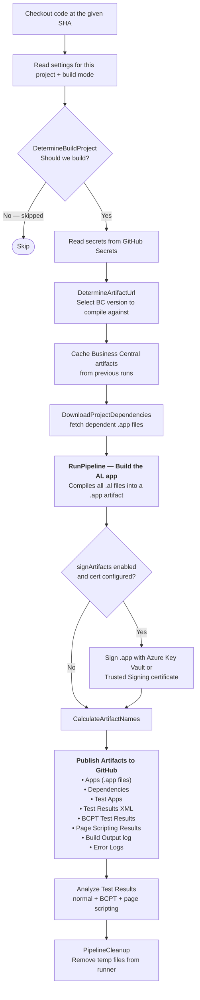
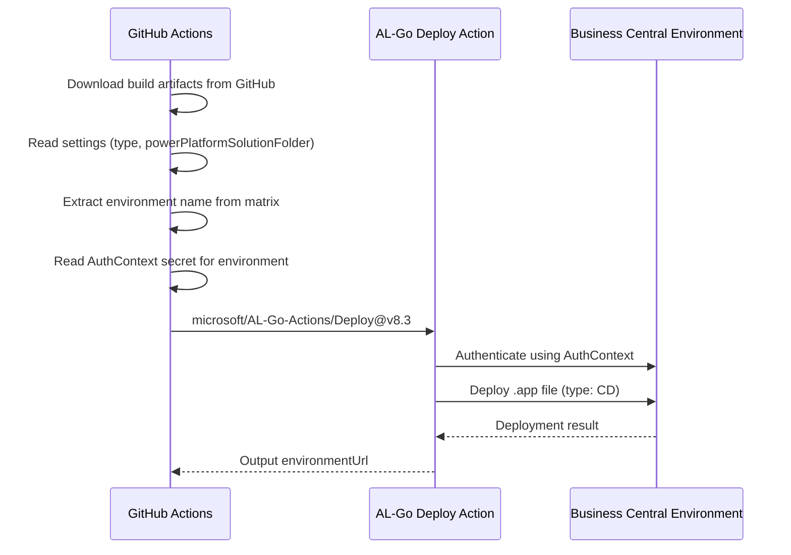
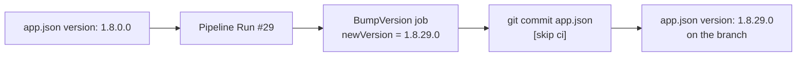
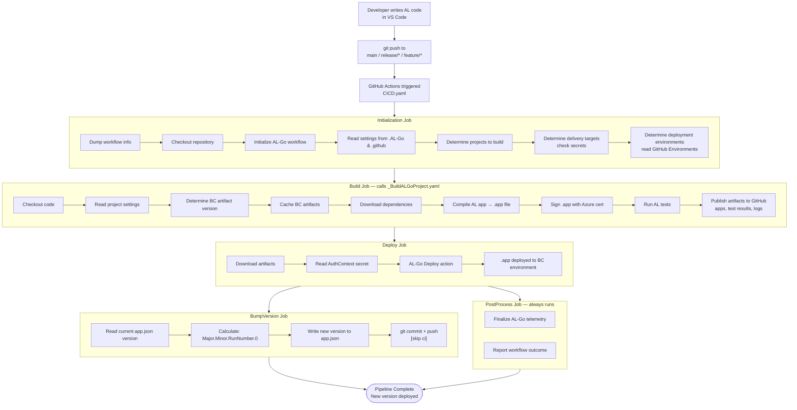
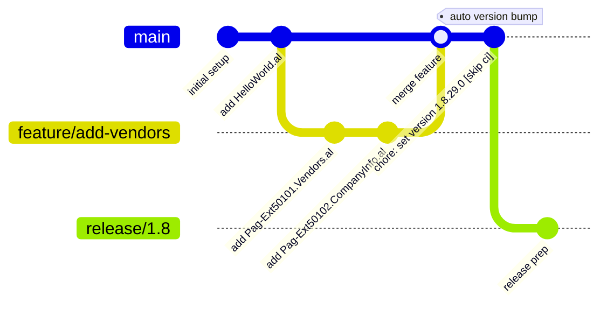

# CI/CD Pipeline Documentation — demo-testing-CICD

> A complete walkthrough of how this Business Central AL extension CI/CD pipeline was built using **AL-Go for GitHub**, from initial repository setup to automated deployment and version bumping.

---

## Table of Contents

1. [Project Overview](#1-project-overview)
2. [Repository Structure](#2-repository-structure)
3. [Step 1 — Setting Up the AL Extension](#step-1--setting-up-the-al-extension)
4. [Step 2 — Initialising AL-Go for GitHub](#step-2--initialising-al-go-for-github)
5. [Step 3 — Configuring AL-Go Settings](#step-3--configuring-al-go-settings)
6. [Step 4 — The GitHub Actions Workflows Explained](#step-4--the-github-actions-workflows-explained)
7. [Step 5 — The Build Process in Detail](#step-5--the-build-process-in-detail)
8. [Step 6 — Deployment to Business Central](#step-6--deployment-to-business-central)
9. [Step 7 — Automatic Version Bumping](#step-7--automatic-version-bumping)
10. [Full End-to-End Pipeline Flow](#full-end-to-end-pipeline-flow)
11. [Branching Strategy](#branching-strategy)

---

## 1. Project Overview

This repository contains a **Microsoft Dynamics 365 Business Central Per-Tenant Extension (PTE)** called `DemoCICD`. It was built to demonstrate and test a full CI/CD pipeline using [AL-Go for GitHub](https://github.com/microsoft/AL-Go) — Microsoft's official GitHub Actions framework for AL development.

| Property | Value |
|---|---|
| App Name | DemoCICD |
| Publisher | Default Publisher |
| App ID | `f8a3c1e2-4b7d-4e91-9f2a-1d8c7e5b3a0f` |
| Platform | 27.0.0.0 |
| Application | 27.0.0.0 |
| Runtime | 16.0 |
| ID Range | 50100 – 50149 |
| AL-Go Template | `microsoft/AL-Go-PTE@v8.3` |
| Extension Type | PTE (Per-Tenant Extension) |

---

## 2. Repository Structure

```
demo-testing-CICD/
├── .AL-Go/
│   ├── settings.json          ← AL project build settings
│   ├── localDevEnv.ps1        ← Script to spin up a local Docker dev environment
│   └── cloudDevEnv.ps1        ← Script to spin up a cloud SaaS sandbox dev env
├── .github/
│   ├── AL-Go-Settings.json    ← Repository-level AL-Go settings (type, template)
│   ├── .agents/
│   │   └── algo-settings.agent.md  ← Copilot agent instructions for AL-Go
│   └── workflows/
│       ├── CICD.yaml                ← Main CI/CD pipeline
│       └── _BuildALGoProject.yaml  ← Reusable build workflow (called by CICD)
├── app/
│   ├── app.json               ← Extension manifest (version, dependencies, etc.)
│   ├── HelloWorld.al          ← Page extension: Customer List (50100)
│   ├── Pag-Ext50101.Vendors.al    ← Page extension: Vendor List (50101)
│   └── Pag-Ext50102.CompanyInformation.al  ← Page extension: Company Info (50102)
├── .gitignore
└── README.md
```

---

## Step 1 — Setting Up the AL Extension

### What was done

The AL extension source code was created inside the `app/` folder. Three page extensions were written to demonstrate publishing to Business Central:

**`HelloWorld.al`** — extends the Customer List:
```al
pageextension 50100 CustomerListExt extends "Customer List"
{
    trigger OnOpenPage()
    begin
        Message('App published: Hello world - Exq');
    end;
}
```

**`Pag-Ext50101.Vendors.al`** — extends the Vendor List:
```al
pageextension 50101 Vendors extends "Vendor List"
{
    trigger OnOpenPage()
    begin
        Message('Welcome to the Vendor List page! - Exquitech 9:44');
    end;
}
```

**`Pag-Ext50102.CompanyInformation.al`** — extends Company Information:
```al
pageextension 50102 "Company Information" extends "Company Information"
{
    trigger OnOpenPage()
    begin
        Message('Welcome to the Company Information page! - Exquitech 13:34');
    end;
}
```

The `app.json` manifest defines the extension metadata, the BC platform version it targets, and the object ID range it uses (50100–50149).

---

## Step 2 — Initialising AL-Go for GitHub

### What is AL-Go for GitHub?

AL-Go for GitHub is Microsoft's official framework that provides ready-made GitHub Actions workflows for the entire AL development lifecycle — compiling, testing, signing, and deploying `.app` files to Business Central environments.

### How it was set up

**Step 1 — Manually create `UpdateGitHubGoSystemFiles.yaml`**

A blank GitHub repository was created and the `UpdateGitHubGoSystemFiles.yaml` file was manually added to `.github/workflows/`. This single file is the only thing needed to bootstrap the entire AL-Go system — it does not require the GitHub template feature. The file was copied from the AL-Go PTE template source and committed directly into the repo.

**Step 2 — Run "Update AL-Go System Files" to generate everything**

From **GitHub → Actions → Update AL-Go System Files → Run workflow**, this workflow was manually triggered. The `CheckForUpdates` action inside it connects to the AL-Go PTE template (`microsoft/AL-Go-PTE@v8.3`) and writes all the system files into the repository:

- `CICD.yaml` — the main CI/CD pipeline
- `_BuildALGoProject.yaml` — the reusable build worker
- `.AL-Go/settings.json` — project build configuration
- `.AL-Go/localDevEnv.ps1` and `cloudDevEnv.ps1` — dev environment scripts
- `.github/AL-Go-Settings.json` — repository-level AL-Go settings
- And many other default AL-Go workflows (CreateRelease, PullRequestHandler, IncrementVersionNumber, etc.)

**Step 3 — Delete the workflows you don't need**

The template generates more workflows than this project requires. The unneeded ones were manually deleted, keeping only the three that matter:

| Kept | Reason |
|---|---|
| `CICD.yaml` | The core pipeline — build, deploy, version bump |
| `_BuildALGoProject.yaml` | Reusable build worker called by CICD |
| `UpdateGitHubGoSystemFiles.yaml` | Needed to re-run future AL-Go updates |

The template version and SHA are pinned in `.github/AL-Go-Settings.json`:

```json
{
  "$schema": "https://raw.githubusercontent.com/microsoft/AL-Go-Actions/v8.3/.Modules/settings.schema.json",
  "type": "PTE",
  "templateUrl": "https://github.com/microsoft/AL-Go-PTE@v8.3",
  "repoVersion": "1.0",
  "templateSha": "30ce9f104b093e803af72a363f5fd843c10788b5"
}
```

The `type: "PTE"` tells AL-Go this is a Per-Tenant Extension (not an AppSource app), which determines which validation rules and deployment paths apply.



---

## Step 3 — Configuring AL-Go Settings

### `.AL-Go/settings.json` — Project-level build settings

This file controls how the AL project is compiled and tested:

```json
{
  "$schema": "https://raw.githubusercontent.com/microsoft/AL-Go-Actions/v8.3/.Modules/settings.schema.json",
  "country": "w1",
  "useCompilerFolder": true,
  "doNotPublishApps": true,
  "versioningStrategy": 0,
  "appFolders": ["app"],
  "enableCodeCop": false,
  "enableAppSourceCop": false,
  "enablePerTenantExtensionCop": false,
  "enableUICop": false
}
```

| Setting | Value | Explanation |
|---|---|---|
| `country` | `w1` | Targets the worldwide (W1) localisation of Business Central |
| `useCompilerFolder` | `true` | Uses a local compiler folder instead of a container, making builds faster |
| `doNotPublishApps` | `true` | Skips automatic publishing during build (deployment is handled separately in the Deploy job) |
| `versioningStrategy` | `0` | Version is managed by the `BumpVersion` job in the pipeline using `GITHUB_RUN_NUMBER` |
| `appFolders` | `["app"]` | Points AL-Go to the `app/` folder as the single project to build |
| `enableCodeCop` | `false` | Code style analysis disabled (suitable for demo/learning purposes) |
| `enableAppSourceCop` | `false` | AppSource submission rules not required (it's a PTE) |
| `enablePerTenantExtensionCop` | `false` | PTE-specific rules disabled |
| `enableUICop` | `false` | UI consistency rules disabled |

---

## Step 4 — The GitHub Actions Workflows Explained

After running **Update AL-Go System Files** and trimming to only the files needed, the repo contains exactly three workflow YAML files. Here is a detailed explanation of each.

---

### `UpdateGitHubGoSystemFiles.yaml`

**Purpose:** The bootstrap and maintenance workflow. This is what generates and keeps all AL-Go system files up to date.

**Triggers:**
- `workflow_dispatch` — manually triggered from GitHub Actions UI
- `workflow_call` — can be called by other workflows

**Inputs you can provide at run time:**

| Input | Default | What it does |
|---|---|---|
| `templateUrl` | _(reads from settings)_ | Override which template version to pull from |
| `downloadLatest` | `true` | Pull the latest commit from the template, not just the pinned SHA |
| `directCommit` | `false` | Commit changes directly to the branch instead of opening a PR |
| `includeBranches` | _(current branch)_ | Comma-separated list of branches to update at once |

**Jobs inside this workflow:**



**Key step — `CheckForUpdates`:** This is the AL-Go action that does the actual work. It downloads the full set of workflow files from the PTE template repository and writes them into `.github/workflows/`. After it runs, you will see all default AL-Go workflows appear in your repo. You then manually delete any you do not need.

**Secret required:** `ghTokenWorkflow` — a GitHub Personal Access Token (PAT) with `workflow` scope, stored as a repository secret. This is needed because writing workflow files requires elevated permissions beyond the default `GITHUB_TOKEN`.

---

### `CICD.yaml`

**Purpose:** The main CI/CD orchestrator. Every push to a tracked branch triggers this file, which coordinates the entire pipeline from build through to deployment and version bumping.

**Triggers:**
- `workflow_dispatch` — manual run from GitHub UI
- `push` to `main`, `release/*`, `feature/*` — automatic on code push (ignores `.md` changes and other workflow file changes)

**Permissions:**

| Permission | Level | Reason |
|---|---|---|
| `contents` | `write` | Push the version bump commit back to the branch |
| `id-token` | `write` | OIDC authentication for Azure Trusted Signing |
| `actions` | `read` | Read workflow run history |
| `security-events` | `write` | Publish AL code analysis results |
| `packages` | `read` | Download BC artifacts from GitHub Packages |

**Jobs and their dependency chain:**



| Job | Runs on | Depends on | Condition |
|---|---|---|---|
| `Initialization` | `windows-latest` | nothing | Always |
| `Build` | matrix (from settings) | `Initialization` | If projects exist to build |
| `Deploy` | matrix (from environments) | `Initialization` + `Build` | If environments configured and build succeeded |
| `BumpVersion` | `windows-latest` | `Deploy` | After successful deploy |
| `PostProcess` | `windows-latest` | All jobs | Always — even on failure |

---

### `_BuildALGoProject.yaml`

**Purpose:** A reusable workflow (`workflow_call` only — never triggered directly). It is called by the `Build` job inside `CICD.yaml` and does all the heavy lifting of compiling, signing, testing, and publishing artifacts.

**Why it is a separate file:** The Build job in `CICD.yaml` runs as a matrix — one instance per project per build mode. Putting the build logic in a separate reusable workflow lets GitHub Actions fan out the matrix jobs cleanly and keeps `CICD.yaml` readable.

**Inputs it receives from CICD.yaml:**

| Input | What it carries |
|---|---|
| `project` | Path to the AL project folder (`app`) |
| `projectName` | Human-readable name shown in the Actions UI |
| `buildMode` | e.g. `Default`, `Clean` |
| `runsOn` | Which runner OS to use (from settings) |
| `baselineWorkflowRunId` | ID of last successful run, for incremental builds |
| `signArtifacts` | `true` — sign the compiled `.app` |
| `useArtifactCache` | `true` — cache BC compiler artifacts between runs |
| `secrets` | Comma-separated list of secrets to read |

**What it produces (artifacts uploaded to GitHub):**

| Artifact | Content |
|---|---|
| Apps | The compiled `.app` file |
| TestApps | Compiled test `.app` if present |
| Dependencies | Dependent `.app` files |
| TestResults | `TestResults.xml` from AL test runner |
| BcptTestResults | `bcptTestResults.json` performance test results |
| PageScriptingTestResults | UI test results |
| BuildOutput | `BuildOutput.txt` full compiler log |
| ErrorLogs | AL code analysis error logs |

---

The pipeline is split into two workflow files for the CI/CD execution:

| File | Purpose |
|---|---|
| `CICD.yaml` | Orchestrator — triggers the pipeline, coordinates all jobs |
| `_BuildALGoProject.yaml` | Reusable worker — does the actual compiling, testing, signing, and artifact publishing |

### Trigger configuration in `CICD.yaml`

The pipeline runs automatically on:

```yaml
on:
  workflow_dispatch:        # Manual trigger from GitHub UI
  push:
    paths-ignore:
      - '**.md'             # Ignore markdown-only changes
      - '.github/workflows/*.yaml'
      - '!.github/workflows/CICD.yaml'  # But still run if CICD.yaml itself changes
    branches: [ 'main', 'release/*', 'feature/*' ]
```



### Permissions granted to the workflow

```yaml
permissions:
  actions: read
  contents: write      # Needed to push the version bump commit
  id-token: write      # Needed for OIDC / Azure Trusted Signing
  pages: read
  security-events: write
  packages: read
```

---

## Step 5 — The Build Process in Detail

### Jobs inside `CICD.yaml`



### Inside `_BuildALGoProject.yaml` — step by step



### Artifact signing

Signing is enabled (`signArtifacts: true` in the Build job call). The Sign step runs when:
- `DetermineBuildProject` decided to build
- `signArtifacts` input is `true`
- `doNotSignApps` is `False` in settings
- Either a `keyVaultCodesignCertificateName` is set **or** Azure Trusted Signing credentials are configured
- There are `.app` files in the build output directory

The `AZURE_CREDENTIALS` secret provides the Azure identity for signing.

---

## Step 6 — Deployment to Business Central

The **Deploy** job runs after a successful Build (or when Build is skipped). It deploys the compiled `.app` file to one or more Business Central environments.



### How environments are configured

Deployment environments are defined in GitHub repository **Settings → Environments**. Each environment must have an `AuthContext` secret containing a JSON credential object that allows AL-Go to authenticate to Business Central and deploy the app.

The `DetermineDeploymentEnvironments` step in **Initialization** reads all configured environments (via `getEnvironments: '*'`) and builds a deployment matrix, so a separate Deploy job runs in parallel for each environment.

---

## Step 7 — Automatic Version Bumping

After a successful deployment, the **BumpVersion** job automatically updates the `app.json` version and commits it back to the branch.

### The version formula

```
Major.Minor.GITHUB_RUN_NUMBER.0
```

For example, if the current version is `1.8.0.0` and this is run number 29, the new version becomes `1.8.29.0`.

### The PowerShell script inside BumpVersion

```powershell
$appJsonPath = "app/app.json"
$content = Get-Content $appJsonPath -Raw
$appJson = $content | ConvertFrom-Json

$v = [System.Version]$appJson.version
$newVersion = '{0}.{1}.{2}.{3}' -f $v.Major, $v.Minor, $env:GITHUB_RUN_NUMBER, 0

$replacement = '"version": "' + $newVersion + '"'
$content = $content -replace '"version":\s*"[^"]*"', $replacement
[System.IO.File]::WriteAllText((Resolve-Path $appJsonPath).Path, $content)

git config user.name "github-actions[bot]"
git config user.email "github-actions[bot]@users.noreply.github.com"
git add $appJsonPath
git commit -m "chore: set version to $newVersion [skip ci]"
git push
```

The commit message includes `[skip ci]` so that pushing the version bump does **not** re-trigger the pipeline.



---

## Full End-to-End Pipeline Flow



---

## Branching Strategy



| Branch Pattern | CI/CD Triggered | Purpose |
|---|---|---|
| `main` | Yes | Production-ready code, full pipeline including deploy |
| `release/*` | Yes | Release candidates, full pipeline including deploy |
| `feature/*` | Yes | Feature branches, builds and tests but typically no environment to deploy to |
| Any other | No | Draft work, pipeline does not run |

---

## Key Technologies & Tools

| Tool | Version | Role |
|---|---|---|
| AL-Go for GitHub | v8.3 | CI/CD framework for AL development |
| GitHub Actions | — | Workflow execution platform |
| Microsoft AL Compiler | BC 27 / Runtime 16 | Compiles `.al` files into `.app` artifacts |
| Business Central | 27.0.0.0 | Target deployment platform |
| Azure Key Vault / Trusted Signing | — | Optional code signing for `.app` files |
| PowerShell | 5.1 / 7+ | All runner scripts and pipeline steps |
